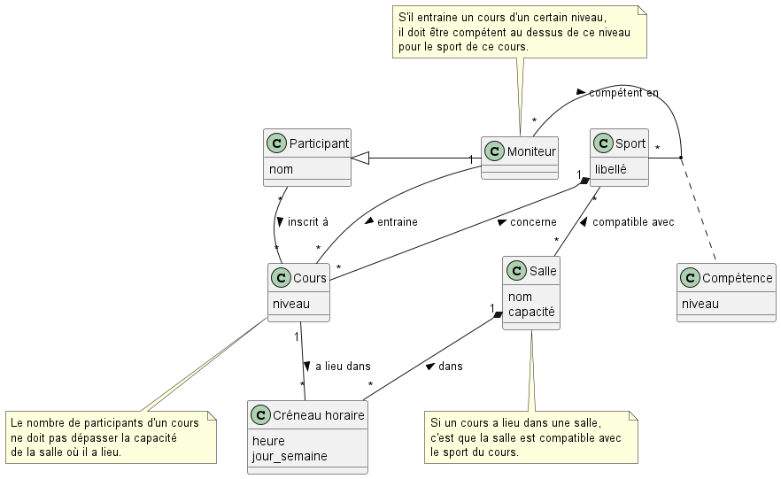

# Diagrammes de classe - Cours de sport
Ecrire un modèle du domaine (diagramme de classe) pour la gestion de cours de sport décrite ci-dessous:
 
- Des sports décrits par un libellé font l’objet de cours d’un niveau déterminé. Par exemple un cours de Karaté de niveau 3ème dan. 
- Ces cours doivent être donnés dans des salles compatibles pour ce sport. Par exemple une salle équipée de paniers pour un cours de basket. 
- Le planning de chaque salle est publié à l’entrée de celle-ci sous la forme d’un tableau hebdomadaire, chaque jour contenant des créneaux horaires déterminés. La suppression d'une salle a pour conséquence la suppression de tous ses créneaux horaires.
- Un cours a lieu chaque semaine dans un ou plusieurs créneaux horaires fixes. Par exemple un cours de Yoga le lundi à 17h00 en salle S12, le mardi en salle S12 et le jeudi en salle T41. 
- Des participants dont on connait le nom s’inscrivent et participent à un cours dans la limite de la capacité des salles dans lesquelles il a lieu. Par exemple, 10 participants sont inscrits pour un cours de spinning donné dans le mardi en salle S3 (12 vélos) et le vendredi en salle S5 (15 vélos). Un même participant peut s’inscrire à plusieurs cours. 
- Un moniteur peut entrainer un cours donné pour autant qu’il soit dans ce sport de niveau supérieur au niveau de ce cours. Par exemple Anne est monitrice de niveau B12 en tennis de table et encadre un cours de niveau C7. 
- Un moniteur peut également s’inscrire comme participant à d’autres cours que ceux qu’il entraine. 

## Consignes
Utilisez le concept de spécialisation (héritage) lorsque c’est possible et adéquat. Montrez la cardinalité des associations de manière explicite (pas de cardinalité par défaut). Nommez les associations simples. 
  
Ne pas rajouter d’informations qui ne se trouvent pas exprimées dans l’énoncé. Mentionnez au moins 2 contraintes qui ne sont pas modélisées dans votre diagramme en les rédigeant de manière à utiliser au maximum les noms des éléments (classe, attributs, associations) de votre diagramme. 

## Corrigé
